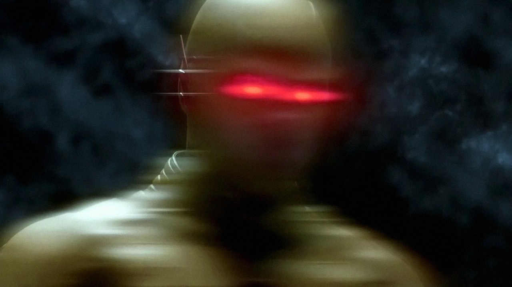

<body>
<!DOCTYPE html PUBLIC "-//W3C//DTD XHTML 1.0 Transitional//EN" "http://www.w3.org/TR/xhtml1/DTD/xhtml1-transitional.dtd">
<html xmlns="http://www.w3.org/1999/xhtml">
<head>
<meta http-equiv="Content-Type" content="text/html; charset=utf-8" />
<title>Documento sin título</title>

</head>

<body onload="MM_preloadImages('Flash-Logo.gif','1526047648_Reverse-Flash-dr-harrison-wells-38759515-500-236.gif')">
<h2></h2>

  <embed src="THE FLASH Theme - [Styzmask Remix](MP3_128K).mp3" width="203" height="45" loop=¨true¨ pluginspage="Speedsters.html"></embed>

&nbsp;

&nbsp;

</body>
</html>
